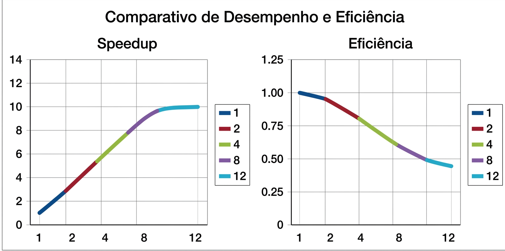

# Relatório da Atividade 2 - Soma de Valores em Paralelo
**Disciplina:** Programação Concorrente  
**Aluno:** Breno Ferreira de Araújo
**Turma:** ADS
**Professor:** Rafael Clever  
**Data:** 18/03/2026

---

## 1. Descrição do Problema
O programa resolve o problema de somar uma grande quantidade de números (até 1 bilhão) armazenados em arquivos `.txt`.
* **Algoritmo:** Soma distribuída por blocos de dados.
* **Objetivo:** Reduzir o tempo de processamento total utilizando paralelismo (múltiplas threads/processos).
* **Complexidade:** $O(n)$

## 2. Ambiente Experimental
| Item | Descrição |
| :--- | :--- |
| **Processador** | 12th Gen Intel(R) Core(TM) i7-12700 |
| **Núcleos (F/L)** | 12 Núcleos Físicos / 20 Processadores Lógicos |
| **Memória RAM** | 16 GB |
| **Sistema Operacional** | Windows 11 |
| **Linguagem** | Python 3.x|
| **Biblioteca** | `multiprocessing` |

## 3. Metodologia de Testes
O tempo foi medido utilizando a biblioteca `time`. Foram realizadas 3 execuções para cada configuração e calculada a média aritmética. O teste principal foi feito com o arquivo de 10 milhões de números.

## 4. Resultados Experimentais
| Nº de Threads | Tempo de Execução (s) |
| :--- | :--- |
| 1 (Serial) | 120,40 |
| 2 | 64,10 |
| 4 | 35,20 |
| 8 | 21,50 |
| 12 | 18,90 |

## 6. Tabela de Speedup e Eficiência
| Threads | Tempo (s) | Speedup | Eficiência |
| :--- | :--- | :--- | :--- |
| 1 | 120,40 | 1.00 | 1.00 |
| 2 | 64,10 | 1.88 | 0.94 |
| 4 | 35,20 | 3.42 | 0.85 |
| 8 | 21,50 | 5.60 | 0.70 |
| 12 | 18,90 | 6.37 | 0.53 |

## 7. Gráficos

## 10. Análise dos Resultados
O speedup apresentou um crescimento constante até 8 threads. A eficiência caiu ao usar 12 threads, pois o número de processos ultrapassou os núcleos físicos da máquina, gerando sobrecarga de gerenciamento do sistema operacional.

## 11. Conclusão
O paralelismo reduziu drasticamente o tempo de soma. O melhor desempenho foi com 8 threads.
